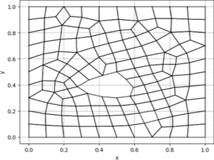

## Why do we need a Mesh?

## Let's Analyze the Fluid Flow in a Bottle

- Fluid Flow Microscopic Scale
<!-- .element: class="fragment" data-fragment-index="1"-->
- Molecules are in constant motion.
<!-- .element: class="fragment" data-fragment-index="2"-->
- Molecules interacts with others.
<!-- .element: class="fragment" data-fragment-index="3"-->
- Molecules collid.
<!-- .element: class="fragment" data-fragment-index="3"-->
- Tracking every individual molecule is impossible!
<!-- .element: class="fragment" data-fragment-index="4"-->

  

      
     
     
    
    
    
  

  

    \[
    \text{Number of molecules} = \left( \frac{\text{Volume} \times \text{Density}}{\text{Molar Mass}} \right) \times N_A
    \]
    Approximately \(3.35 \times 10^{25}\) molecules
    <!-- .element: class="fragment" data-fragment-index="3"-->
  

## Fluid as Continuum
 
Description of the Fluid via Navier-Stokes-Equation

  
  
  
  
 

`$$
\begin{aligned}
  \textcolor{blue}{\frac{\partial{}}{\partial{t}} \underline{u}} + 
  \textcolor{orange}{\underline{u} \cdot \left( \nabla \cdot \underline{u} \right)}
  & =
  \textcolor{magenta}{\nu \nabla \cdot \left( \nabla \cdot \underline{u} \right)} -
  \textcolor{green}{\frac{1}{\rho} \nabla p}
  \\
  \nabla \cdot \underline{u} 
  & = 
  0
\end{aligned}
$$`
<!-- .element: class="fragment fade-in" data-fragment-index="5" -->

## Triangulated Mesh

### Delaunay Triangulation

- Subdivides the convex hull of a point-cloud into triangles.
<!-- .element: class="fragment" data-fragment-index="1"-->
- Circumcircles of the triangles do not contain any of the points.
<!-- .element: class="fragment" data-fragment-index="2"-->

    

      

### Bowyer-Watson Algorithm

    

      
      
      
      
       
         

  

## Quadrilateral Mesh 

### Triangulation vs Quadrilateral Methods

- Quadrilateral mesh generation difficult task
<!-- .element: class="fragment" data-fragment-index="1"-->
- Geometrical "stiff" structure
<!-- .element: class="fragment" data-fragment-index="2"-->
- Inserting Node
<!-- .element: class="fragment" data-fragment-index="3"-->
  - 2D: Possible, but not good
<!-- .element: class="fragment" data-fragment-index="4"-->
  - 3D: Impossible!
<!-- .element: class="fragment" data-fragment-index="5"-->

  

      

## Indirect Meshing
### Triangle Merge

  

    <ul>
      <li class="fragment fade-in" data-fragment-index="0">Generate a Triangulated Mesh.</li>
      <li class="fragment fade-in" data-fragment-index="1">Delete an Edge between two Triangles to Generate a Quad.</li>
    </ul>
  

  

    

      
      
      <video
        class="fragment fade-in"
        autoplay
        loop
        controls
        src="./assets/IndirectMeshTransformation.mp4"
        data-fragment-index="2"
      >
      </video>
    

  

## Cross Fields for Quadrilateral Meshes
### Introduction 

  

    
    
     
     
     
  

- Define Geometry.
<!-- .element: class="fragment" data-fragment-index="0" -->
- Assume a Quadrilateral Mesh Structure.
<!-- .element: class="fragment" data-fragment-index="1" -->
- Abstract Mesh: Nodes as Line Intersections.
<!-- .element: class="fragment" data-fragment-index="2" -->
- Abstract Mesh: At Each Node Four Orthogonal Vectors.
<!-- .element: class="fragment" data-fragment-index="3" -->
- Crosses Known Along the Boundary.
  <!-- .element: class="fragment" data-fragment-index="4"-->

## Cross Fields for Quadrilateral Meshes
### Overall Approch

- Calculate Normal and Tangent Vectors Along the Boundary.
<!-- .element: class="fragment" data-fragment-index="0"-->
- Simplify Cross-Field to Frame-Field
<!-- .element: class="fragment" data-fragment-index="1"-->
 
- Propagate Information from Boundary to the domain's interior. 
<!-- .element: class="fragment" data-fragment-index="2"-->
- Mapping Frame-Field to Cross-Field. 
<!-- .element: class="fragment" data-fragment-index="3"-->

  

    
    
    
    
  

## Cross Fields for Quadrilateral Meshes
### Irregularities Identification

- Singularities: Locations where Frame Field is not defined.
<!-- .element: class="fragment" data-fragment-index="0"-->
-  
- Marks Locations Where the Mesh needs Special Treatment
<!-- .element: class="fragment" data-fragment-index="2"-->
  

  

 
 

 
 

## Neural Networks

### Neural Networks (NN) vs Graph Neural Networks (GNN)

### NN
- Euclidean data
<!-- .element: class="fragment" data-fragment-index="1"-->

### GNN
- Non-Euclidean data
<!-- .element: class="fragment" data-fragment-index="1"-->

## Graph Neutral Network Indirect Meshing

## Overall Approch

